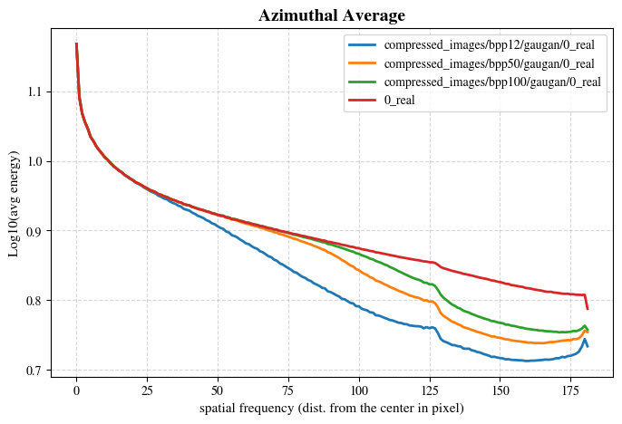

# Detecting deepfakes images processed with JPEG AI
This repository contains the code and methodology for evaluating the impact of JPEG AI (an end-to-end learned image compression standard) on state-of-the-art deepfake detectors. The project explores how neural compression disrupts the low-level frequency fingerprints of synthetic images and proposes mitigation strategies to restore detector robustness.

📺 **[View the Project Presentation here](https://docs.google.com/presentation/d/1NKq7MHmWBuwp-Imk_0frOB_o_lDOQMvFOj-8_9xPViw/edit?usp=sharing)**

## 📌 Project Architecture

Due to the computational requirements and software dependencies of the JPEG AI reference codec, the pipeline is split into a hybrid local/cloud architecture:

1. **Local Environment:** A local Python script handles the heavy lifting of compressing the dataset at various Bit-Per-Pixel (BPP) rates using the official JPEG AI codec.
2. **Cloud Storage:** Both original and compressed image datasets are hosted and organized on **Google Drive**.
3. **Cloud Compute:** The forensic analysis, model evaluation, and mitigation strategies are executed on a **Jupyter Notebook** (designed for Google Colab environment), mounting the Google Drive storage directly.

## 📁 Repository Structure

* `lib/jpeg-ai-reference-software`
    * `compress_CNN_dataset.py`: The local script used to batch-compress images using the JPEG AI reference software.
* `notebooks/`
    * `CV_project_Notebook_Pilot.ipynb`: The main notebook containing the full experimental pipeline (Data loading, Detector Evaluation, Frequency Analysis, and Mitigation).

## 📊 Dataset

This project utilizes images sampled from the **CNNDetection** benchmark (Wang et al.). The dataset maintains a strict 50/50 balance between original real images and generated deepfakes to ensure an unbiased evaluation. 

The data is logically divided into four evaluation subsets across multiple BPP levels:
* `OR` (Original Real)
* `OF` (Original Fake)
* `CR` (Compressed Real)
* `CF` (Compressed Fake)

*(Note: The entire compressed dataset is not included in this repository due to size constraints. They must be downloaded and compressed locally, then uploaded to Google Drive.)*

## 📉 Evaluation
This section benchmarks the performance of state-of-the-art deepfake detectors when exposed to neural image compression via JPEG AI. The goal is to quantify the performance degradation as a function of the target bitrate (BPP). The table below summarizes _a subset_ of the detector's performance across the evaluated subsets (more details in the presentation), showcasing a severe drop in reliability as compression strength increases (lower BPP):

| Detector | Target BPP | Accuracy (%) | AP (%)|
| :--- | :---: | :---: | :---: | 
| CLIP:ViT-L/14 | 12 |61.545994 | 74.835906	 |
| CLIP:ViT-L/14 | 100 |87.292441 | 95.668227	 |
| CLIP:ViT-L/14 | uncompressed |92.070456 | 98.516428	 |
| blur_jpg_prob0.1 | 12 | 54.539211 | 61.012895 |
| blur_jpg_prob0.1 | 100 | 91.068421 |	96.745526 |
| blur_jpg_prob0.1 | uncompressed |93.336053 | 97.980789	 |

## 🔬 Forensic analysis
It is crucial to observe how JPEG AI modifies the frequency components of a given image, whether it is real or a deepfake. Regardless of the veracity of an image, JPEG AI tends to leave recognizable traces in the frequency domain, which strictly vary based on the target BPP.

An immediate example is the following, in which the average azimuthal profile is evaluated over a set of images:

These profiles were calculated on real images from the GauGAN dataset, compressing them at 12, 50, and 100 BPP. Note how compressed images exhibit an increasingly lower average energy compared to uncompressed ones, directly proportional to the BPP strength. Crucially, all compressed profiles share a unique neural artifact: a high-frequency energy rebound at the spectrum boundary (around the 180-pixel radius), which pristine images do not possess.

More details [here](https://github.com/CasuFrost/JPEG-AI-deepfake-detection/tree/main/results/frequency_analysis.md).

## 🛡️ Mitigation strategies

#TODO