# Azimuthal Average
In this section we evaluate the average energy of a certain dataset as the radial frequency varies, we see how these curves differ based on the BPPs, and the authenticity of the images.
### Gaugan
Below is the azimuthal average graph for the Gaugan dataset, which has been compressed to 12, 50 and 100 BPP, considering  the real images on the left, and the deepfakes on the right:

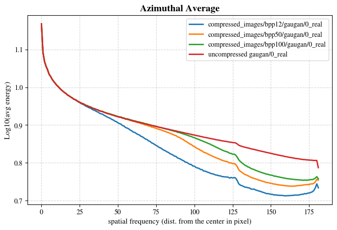
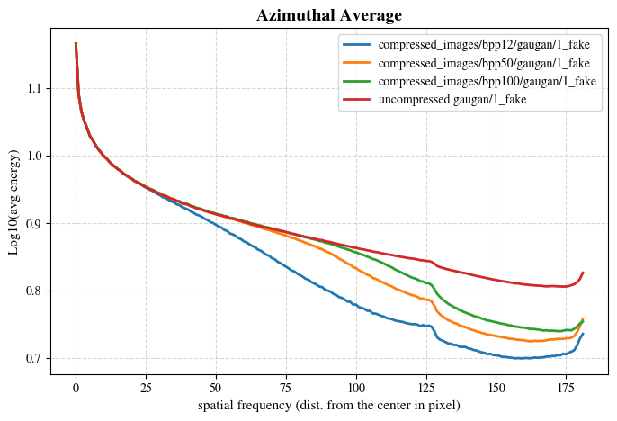

We can already see the differences. Before reporting the results, let's look at the same graph for other datasets:

### Stargan

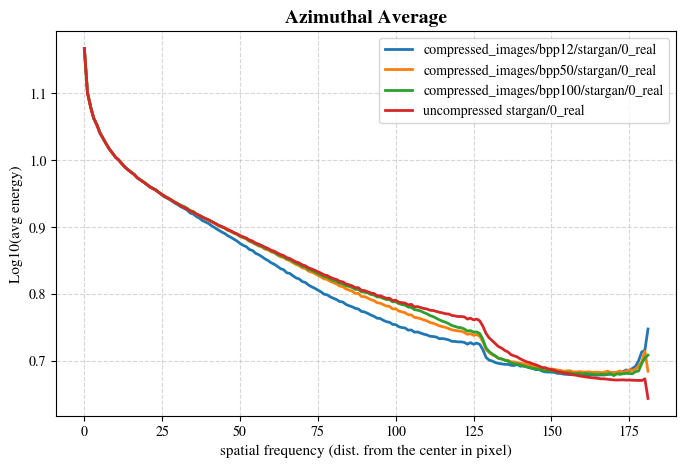
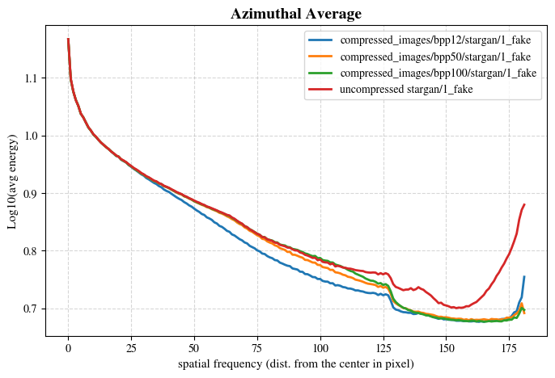

### Crn

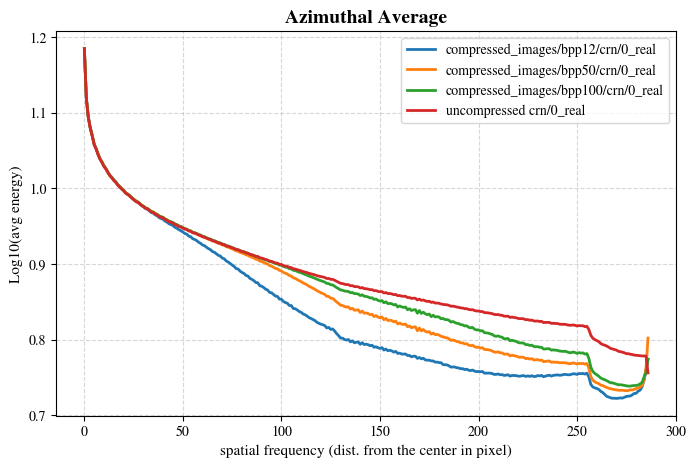
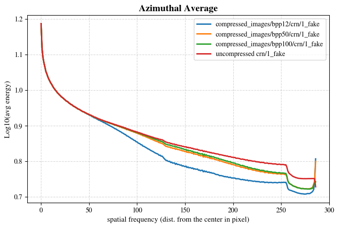

### Imle

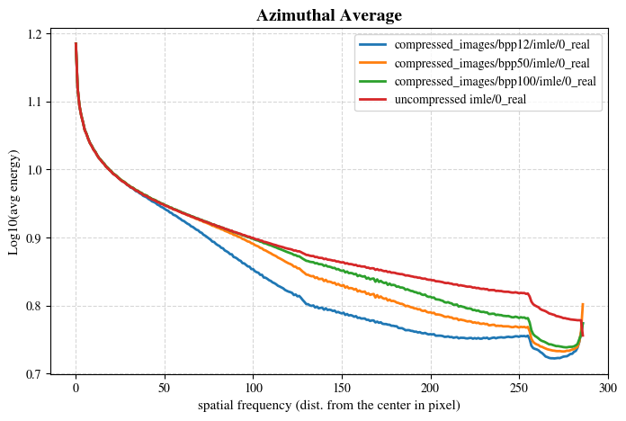
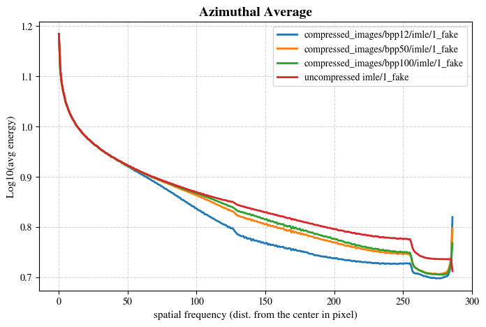

The results are clear: Real uncompressed images always have a monotonically decreasing curve, the average energy tends to decrease as the frequency increases, differently, real compressed images, although they follow a similar profile initially at low frequencies, tend to decrease on high frequencies, and then have a peak around 180 Hz which is not present for uncompressed images. 

Differently, for deepfakes the difference between compressed and uncompressed is smaller, compressed images always have a lower energy but follow a similar profile, the interesting case is shown on Gaugan and Stargan: Uncompressed deepfake images have high frequency peaks just like compressed images: This trace may be one of the reasons why deepfake detectors tend to classify images that have been passed through JPEG AI less precisely.

Leaving aside the veracity of the images, note how the energy (in the compressed images) seems proportional to the BPPs, the higher these are, the higher the average energy is (at every frequency, excluding the low frequencies where the curves coincide).

## Global Results
In this section we group the results for all the datasets combined.

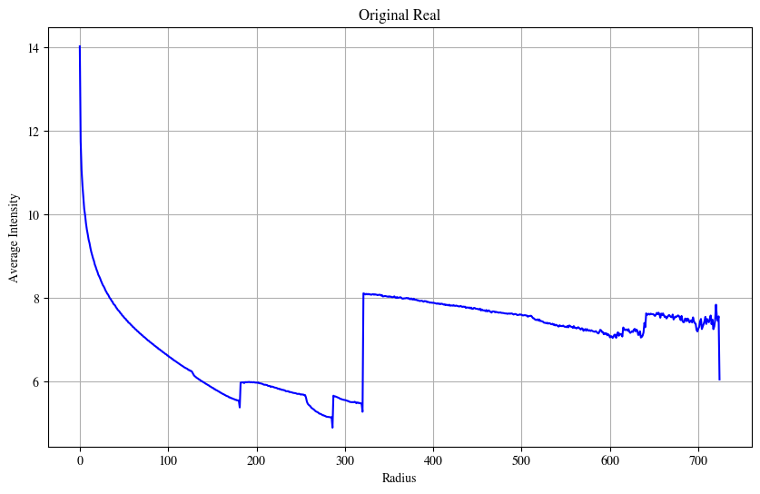
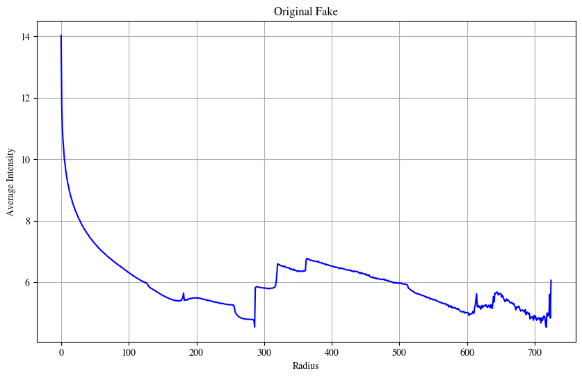

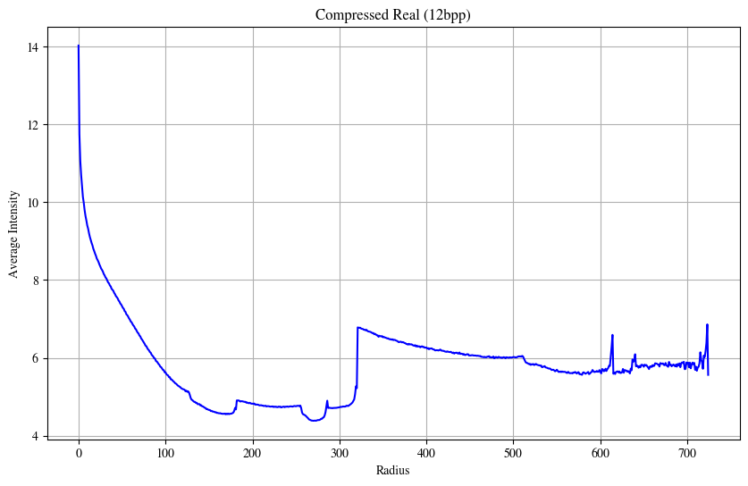
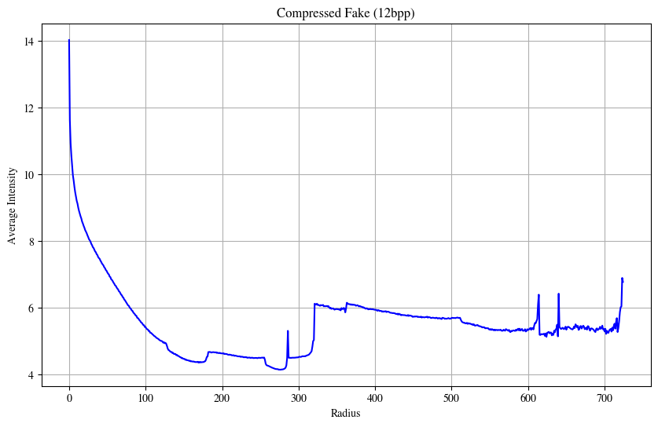

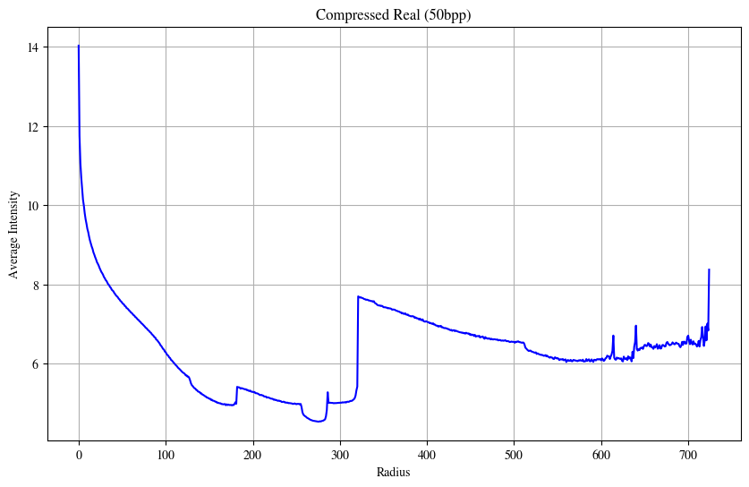
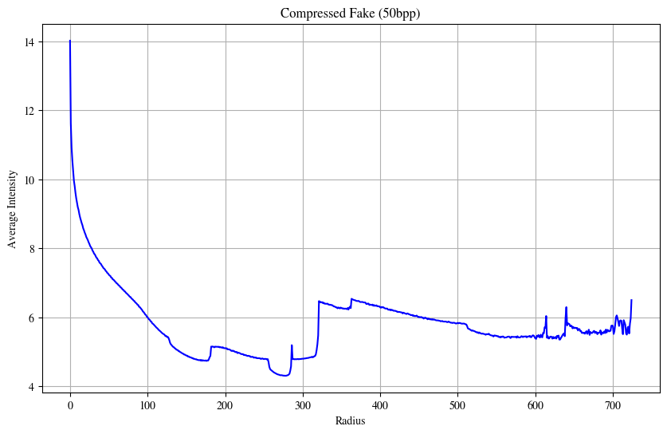

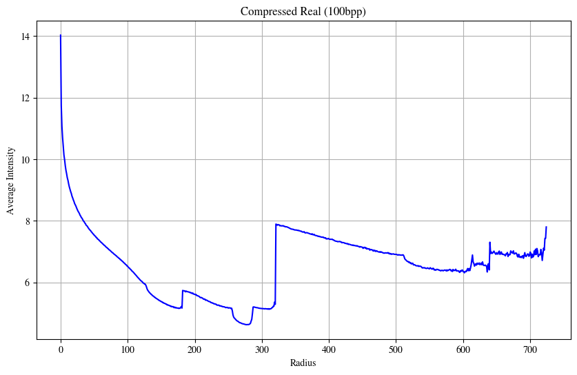
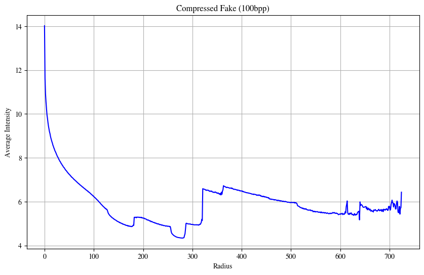

# Power Spectrum

## Global Results

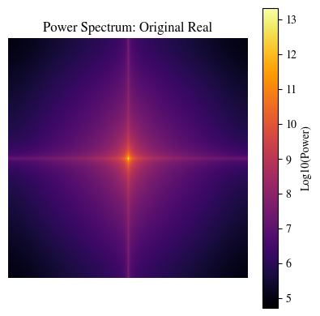
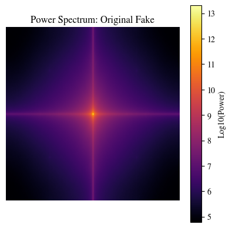

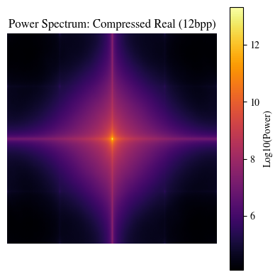
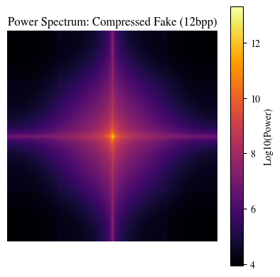

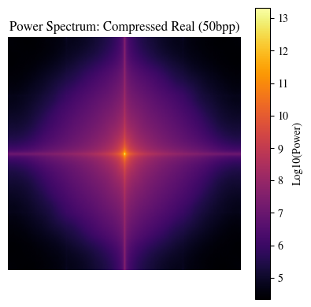
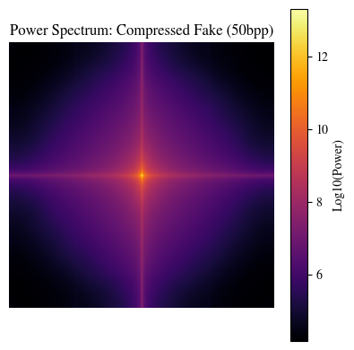

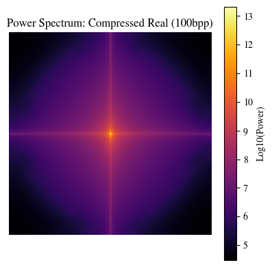

